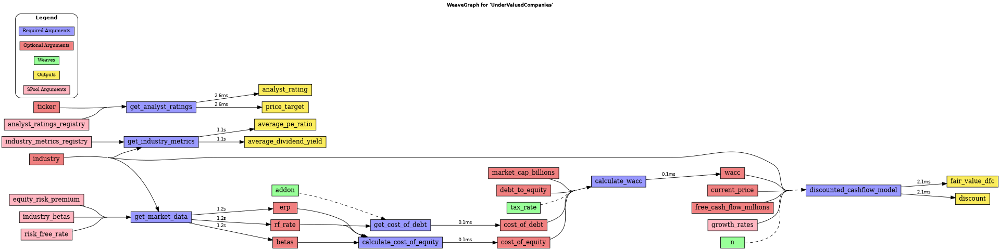

<div align="center">
  
  <h1>weaveflow</h1>
  <p>
    <strong>Make your pandas processes flow with ease, your functions <code>weaveable</code>, and your data processing <code>refineable</code>. Create beautiful, readable,  standardized, and visual data pipelines.</strong>
  </p>
  <p>
    <a href="https://pypi.org/project/weaveflow/"></a>
    <a href="https://github.com/astral-sh/ruff"></a>
    <a href="https://github.com/kopib/weaveflow/actions/workflows/python-app.yml"></a>
  </p>
</div>

---

**weaveflow** is a Python library designed to bring clarity, structure, and visibility to your pandas data processing workflows. It transforms complex sequences of operations into a declarative, dependency-aware pipeline that is easy to read, maintain, and visualize.

Stop wrestling with tangled scripts and start weaving elegant data stories.

## ✨ Core Concepts

`weaveflow` introduces a few simple but powerful concepts to structure your data pipelines:

*   **🧵 Weaving**: Make your functions **`weaveable`**. A `@weave` decorator turns any Python function that operates on pandas Series into a node in a dependency graph. It automatically tracks inputs (from DataFrame columns) and outputs (to new DataFrame columns), building a clear feature engineering lineage.

*   **🔪 Refining**: Make your data **`refineable`**. A `@refine` decorator marks classes or functions that perform larger, sequential transformations on the entire DataFrame, such as cleaning, filtering, dropping rows, or grouping. These steps form a clear, linear processing chain.

*   **🛢️ spooling**: Externalize your parameters effortlessly. The `@spool_asset` decorator loads constants, configurations, and even small data files via customized engines (like CSVs) into dataclasses, making your pipeline's parameters transparent and easy to manage outside your code.

*   **🧶 Loom**: The `Loom` is the heart of `weaveflow`. It's the orchestrator that takes your initial DataFrame and a list of `weaveable` and `refineable` tasks, and executes them in the correct order, managing all dependencies automatically.

*   **📊 Visualization**: `weaveflow` automatically generates intuitive graphs of your pipeline.
    *   The **`WeaveGraph`** shows the dependency network of your feature engineering (`@weave`) steps.
    *   The **`RefineGraph`** shows the sequential flow of your data refinement (`@refine`) steps.

## 🚀 Key Features

*   **Declarative Pipelines**: Define *what* you want to do, not *how*. `weaveflow` handles the execution order.
*   **Automatic Dependency Graph**: Understand at a glance how your features are derived. No more guessing which function created which column.
*   **Clear Separation of Concerns**: A clean distinction between column-wise feature creation (`@weave`) and table-wise transformations (`@refine`).
*   **Effortless Parameterization**: Decouple configuration from logic using `@spool_asset` with YAML, JSON, TOML, and even custom file types.
*   **Stunning Visualizations**: Generate `graphviz` diagrams of your entire workflow to share with your team, document your process, or debug complex flows.
*   **Reproducibility**: By structuring your code and externalizing parameters, `weaveflow` pipelines are easier to reproduce and validate.
*   **Code as Configuration**: Your pipeline is defined by a simple list of functions and classes, making it self-documenting.


## 🔧 Local Development Setup

If you want to contribute to `weaveflow` or use the absolute latest, unreleased version, you should install it from a local clone of the repository. This project uses `uv` for high-performance package management and `pygraphviz` for graph visualization. Make sure these dependencies are installed before proceeding.

**Install `uv` and `pygraphviz`:**

```bash
# Install uv
pip install uv

# For Debian/Ubuntu
sudo apt-get update && sudo apt-get install -y graphviz

# For MacOS (using Homebrew)
brew install graphviz
```

**Setup your local development environment:**

```bash
git clone https://github.com/kopib/weaveflow.git
cd weaveflow

uv pip install -e .
```

Now you're ready to develop and test `weaveflow` locally.

## 🏁 Quickstart: An illustrative example pipeline

To see `weaveflow` in action, run the `quickstart.py` script:

```bash
uv run quickstart.py
```

This generates two beautiful graphs of the data pipelines:

#### Weave Graph
*Shows how your columns are created and what they depend on.*

<div style="overflow: auto;">
  
</div>

#### Refine Graph
*Shows the high-level, sequential stages of your data transformation.*

<div style="overflow: auto;">
  
</div>

## License

This project is licensed under the MIT License.

<a href="https://opensource.org/licenses/MIT"></a>
